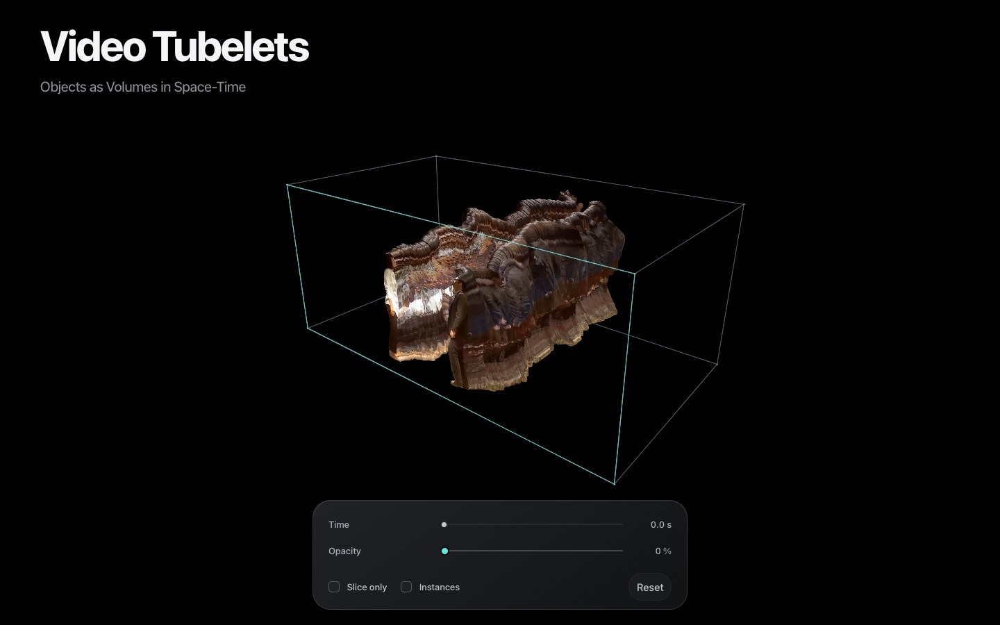

# Video Tubelets

**Objects as Volumes in Space-Time**

What does a dance look like when time becomes a dimension? Video Tubelets stacks video frames through time, isolating two dancers so their movement becomes a volume you can rotate and slice.

[**Explore the live demo →**](https://CSProfKGD.github.io/video-tubelets/)

[](https://CSProfKGD.github.io/video-tubelets/)

Built with React, TypeScript, Vite and Three.js, adapting [Spacetime Volume](https://github.com/CSProfKGD/spacetime-volume). Rendering runs entirely in your browser with precomputed SAM 2.1 masks.

## Explore

- **Time** — move through the clip and reveal the retained frames.
- **Opacity** — fade the background while keeping the dancers visible.
- **Slice only** — isolate the current video frame.
- **Instances** — switch to aqua/coral volumes with soft satin lighting.
- **Drag / scroll / pinch** — orbit and zoom. **Reset** restores the opening view.

A WebGL 2 browser with hardware acceleration is required. The first load downloads the selected volume tier; phones and lower-memory devices use a smaller dataset.

## Run

Node 24+ and pnpm 11.25:

```sh
pnpm install
pnpm dev
```

Open http://127.0.0.1:5177. The Time slider removes earlier frames. Opacity adjusts the background, preserving the dancers. **Slice only** shows just the current XY plane, with no neighboring volume frames. **Instances** renders the woman in aqua and the man in coral with opaque interiors and soft satin lighting. Both checkboxes default off and ease between modes over 240ms (immediate with reduced motion). Slice-only colors remain flat. Drag to orbit; scroll to zoom. Reset restores the original pose and defaults. Arrow keys step one frame; Shift steps ten; Home/End reach the endpoints.

The full-frame volume keeps the original 1280:544 aspect ratio. Desktop samples are 800×340×360 (489,600,000 GPU bytes); compact samples are 400×170×240 (81,600,000 bytes). Each tier includes the first and last source frames.

## Reproduce masks and assets

Install FFmpeg and Python 3.12, then install `scripts/requirements-lock.txt` in a virtual environment. Download the [SAM 2.1 large checkpoint](https://github.com/ultralytics/assets/releases/download/v8.3.0/sam2.1_l.pt) to `.cache/models/sam2.1_l.pt`.

```sh
python scripts/segment_dancers.py --source '/path/to/source.mp4'
ffmpeg -i '/path/to/source.mp4' -vf reverse -an -c:v ffv1 .cache/reverse.mkv
python scripts/segment_dancers.py --source .cache/reverse.mkv --reverse
python scripts/compare_masks.py --source '/path/to/source.mp4'
```

Run GPU tracking passes sequentially. Prompts are source-resolution points in `scripts/dancer-prompts.json`; object 0 is the woman and object 1 the man. The script applies corrective prompts at their exact source frames. Use `--device cpu` on machines without MPS. Review the full sequence and directional disagreement sheets before selecting final masks; do not treat agreement as an annotated accuracy score.

Final mask selection and packaging commands are documented in CONTEXT.md. Intermediate per-person masks, checkpoints and QA videos remain in ignored local directories. The supplied source video is unchanged and is not included in the repository.

## Check

```sh
pnpm typecheck
pnpm test
pnpm build
pnpm test:browser
python tests/audit_dancers.py --source '/path/to/source.mp4'
```

Install the browser once with `pnpm exec playwright install chromium`. Browser tests use the local development server on port 5177. Set `PLAYWRIGHT_MODULE` and `CHROME_EXECUTABLE` if the defaults are unavailable. Tests cover pixel equivalence with the original unchecked shader, fractional-time continuity, GPU/source slices, controls, reset interruption, camera pivot, touch, reduced motion and responsive layout. QA outputs go to `.qa`.

## Local teaser export
The 32-second full-song teaser and 15-second looping cut use a deterministic export-only director at 1080p60; interactive UI is unchanged. Decode source PNG frames to `.cache/teaser/rgb/%05d.png` (numbering begins at zero), and source stereo PCM audio to `.cache/teaser/source-audio.wav` at 48 kHz. With the local dev server running:

```sh
node scripts/render_teaser.mjs --storyboard
python scripts/teaser_audio.py
node scripts/render_teaser.mjs
sh scripts/finish_teaser.sh

# Short edit: original-speed excerpt, matching volume, 1.8s rewind and loop return.
python scripts/teaser_audio.py --short
node scripts/render_teaser.mjs --short
sh scripts/finish_teaser.sh --short
python3 tests/teaser-short.py
```

The MP4s are `exports/video-tubelets-teaser.mp4` and `exports/video-tubelets-teaser-short.mp4`. The short edit's timing and source-frame endpoints are in `scripts/teaser-short.json`. Rewind audio follows the exact reverse time curve, with no synthetic effect. Exported media and decoded source frames stay local and ignored by git.

## GitHub Pages

The included workflow tests and builds the app, then publishes `dist/` to GitHub Pages on each push to `main`. In repository **Settings → Pages**, select **GitHub Actions** as the source. Vite uses relative asset paths so the same build works under a repository subdirectory.

The checked-in `public/volume` contains the ready-to-use RGB, coverage and identity chunks; no Python or model inference is needed to run the demo. Source movies, audio, checkpoints, raw masks, and local exports are excluded.

## Data and attribution

Demo imagery is from the *Pulp Fiction* dance scene supplied for this project; film imagery and music belong to their respective rights holders. The interactive demo has no audio. Segmentation uses [SAM 2.1](https://github.com/facebookresearch/sam2) through [Ultralytics](https://github.com/ultralytics/ultralytics). Fine errors can remain around hair, hands and motion blur. Processing settings and validation are recorded in [CONTEXT.md](CONTEXT.md).
